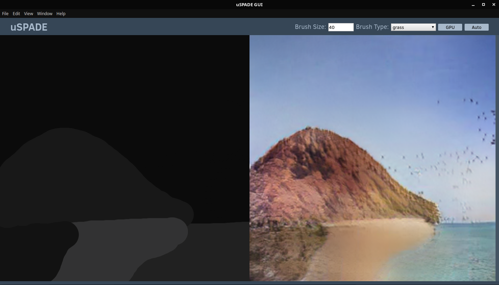

# SPADE-GUI
NVIDIA SPADE GUI tool, for Linux.

This is a recreation of the NVIDIA SPADE [demonstration app](https://youtu.be/p5U4NgVGAwg) they showed at GTC 2019. It will do most things that the demonstration app could do, which is take a MS Paint-like input from the user and convert it in semi-real time to a photo-realistic image. It will first function using the ADE20K pretrained model released, and may eventually support the COCO-Stuff dataset model.

A previous version of this app used a modified version of SPADE with certain features removed. The current public version of this app uses a Git submodule instead. This Git submodule must be renamed from `SPADE` to `uSPADE` to function with the app.

The Git repository of SPADE and the licensing info can be found [here](https://github.com/NVlabs). While this code is licensed under MIT, the modified version of SPADE shares the [CC BY-NC-SA 4.0](https://creativecommons.org/licenses/by-nc-sa/4.0/) license provided by NVIDIA.

The Flickr Landscapes (40k) data set shown in the video was not open sourced by NVIDIA, but was open sourced by some nice folks who trained the model themselves. I am looking at this currently and attempting to figure out how to integrate it with SPADE-GUI. This implementation will come before the COCO-Stuff dataset.

## Install and Use

### Prerequisites

This repository does not have a packaged version of the app yet, as such, you will need to build it using npm.

To use SPADE-GUI, you need the following beforehand:

1) Python 3.6 64bit, callable in terminal with `python3 file.py`

2) Running Linux for TensorFlow to work properly

3) NPM / NodeJS installed

### Installing SPADE-GUI

After obtaining the software and cloning the repository, installation can continue:

1) Rename `SPADE` folder to `uSPADE` (no other changes necessary)

2) Run `python3 -m pip install -r pyrequirements.txt`

3) Run `npm install` and `npm start`

### Usage

The SPADE-GUI interface is designed to be much more user friendly in terms of synthesizing completely new images than the bare command line that SPADE uses. This is a quick description of use for those that may be confused. Upon launching the app, a top bar is shown along with a left section and right section, denoted by different shades of blue.

The top bar allows you to pick the brush size, brush type, GPU/CPU mode, and manual or automatic updating of the live preview. If manual updating is chosen, an update button will appear, which when pressed, will trigger the update of the live preview. The left section is where a semantic map can be drawn, as shown in the demo image above. The right half will show the generated image from SPADE.
